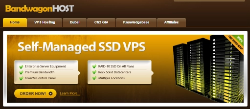

# BandwagonHost's Most Affordable Plan Returns: $17.71/Year for US Fremont VPS with 1TB Monthly Traffic

Looking for a budget-friendly overseas VPS without compromising on performance and network quality? Great news! BandwagonHost's popular MINICHICKEN plan is back in stock, priced at just $17.71 per year. For users on a tight budget who still want a stable experience, this is absolutely the go-to choice for a backup server or lightweight applications.

---

## Plan Configuration and Core Highlights

This package is located in the Fremont (FMT2) data center in California, USA. While it's not BandwagonHost's top-tier CN2 GIA-E line, its network performance is still excellent, especially for China Telecom users.

**Configuration Overview:**

- **Storage:** 20 GB SSD
- **RAM:** 1 GB
- **CPU:** 1 core
- **Traffic:** 1000 GB/month
- **Bandwidth:** 1Gbps
- **Price:** $17.71/year (after coupon code)

**Promo Code:** BWHCGLUKKB

**Test IP:** 45.62.101.3

## Why Is It Such Great Value?

After actual testing, this VPS performs way beyond products in the same price range, especially in terms of network connectivity.

### 1. Hardware Performance: Small Package, Big Power

Don't let the modest specs fool you—its performance is rock solid. The single-core CPU runs stably, with disk read/write speeds reaching 864MB/s, far surpassing most VPS options at this price point. Whether you're deploying a lightweight website, API interfaces, or setting up a reverse proxy, everything runs smoothly without any lag.

### 2. Network Optimization: A Blessing for Telecom Users

Though it's a standard line, the domestic three-network return routes are all direct connections, performing exceptionally well.

- **China Telecom users:** Both outbound and return routes use the AS4134 backbone network, with latency as low as 150ms, comparable to some premium routes.
- **China Unicom/Mobile users:** While latency is slightly higher, they still enjoy direct connection routes with no detours, ensuring connection stability and reliability.

If you're considering a reliable VPS for your projects, many users find that 👉 [BandwagonHost delivers consistent performance at an unbeatable price point for budget-conscious developers](https://bandwagonhost.com/aff.php?aff=79616), making it ideal for various deployment scenarios.

### 3. Speed Tests: Gbps-Level Bandwidth Experience

In upload and download speed tests, this VPS performed impressively. Upload speeds for Telecom and Unicom can approach 500Mbps, while Mobile can reach 300Mbps+. Download speeds at some nodes can even hit Gbps levels, perfect for users with speed requirements.

### 4. Streaming Unblocking: Meets Most Needs

While the VPS IP isn't a pure native IP, its unblocking capability for common streaming platforms is still quite good.

- Supports TikTok US region access and live streaming
- Some IPs can unblock Netflix US region
- YouTube 4K video playback is smooth and effortless

## Who Should Buy This VPS?

- **Overseas TikTok operators or live streamers:** Need a stable, low-latency overseas server to run their business
- **Lightweight website builders:** Whether you're setting up a blog, showcase site, or deploying WordPress or BT-Panel, it handles everything with ease
- **Users needing overseas transit or reverse proxy services:** Strong network performance makes it an ideal transit node
- **China Telecom users:** This VPS is especially friendly to Telecom networks—if you're a Telecom user, you'll get an experience comparable to premium optimized routes

---

## Conclusion

If you're searching for an affordable, network-stable, and performance-reliable backup server or lightweight application server, this BandwagonHost MINICHICKEN plan is definitely a choice you can't afford to miss. With its excellent price-to-performance ratio and solid network connectivity, it stands out as one of the best budget VPS options available. That's exactly why 👉 [BandwagonHost continues to be the preferred choice for cost-effective hosting solutions](https://bandwagonhost.com/aff.php?aff=79616) among savvy users worldwide. Limited stock available—first come, first served!
